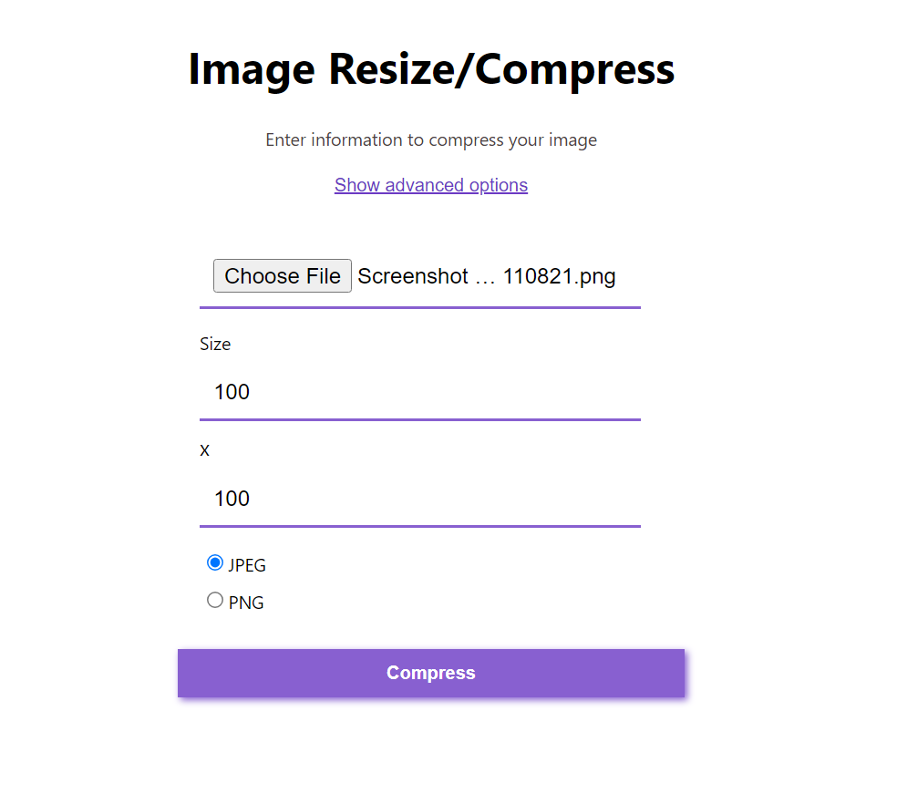
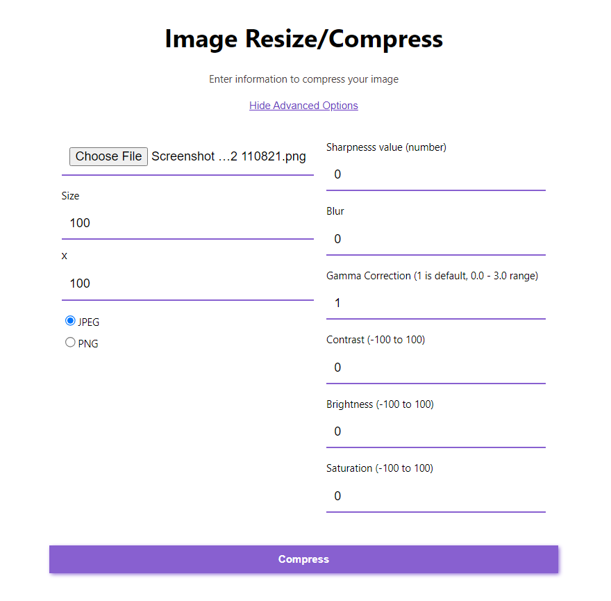

# Image Compressor & Editor

Install dependencies

```
go get github.com/disintegration/imaging; go mod tidy
```

To run:

```
go run main.go
```

Server will be running on
<a>http://localhost:8080</a>

---

### Images




